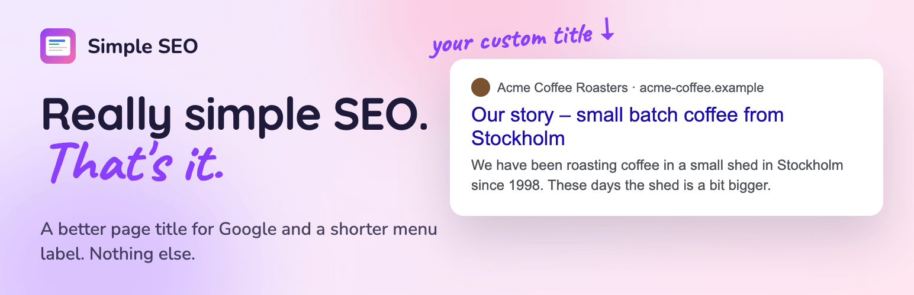
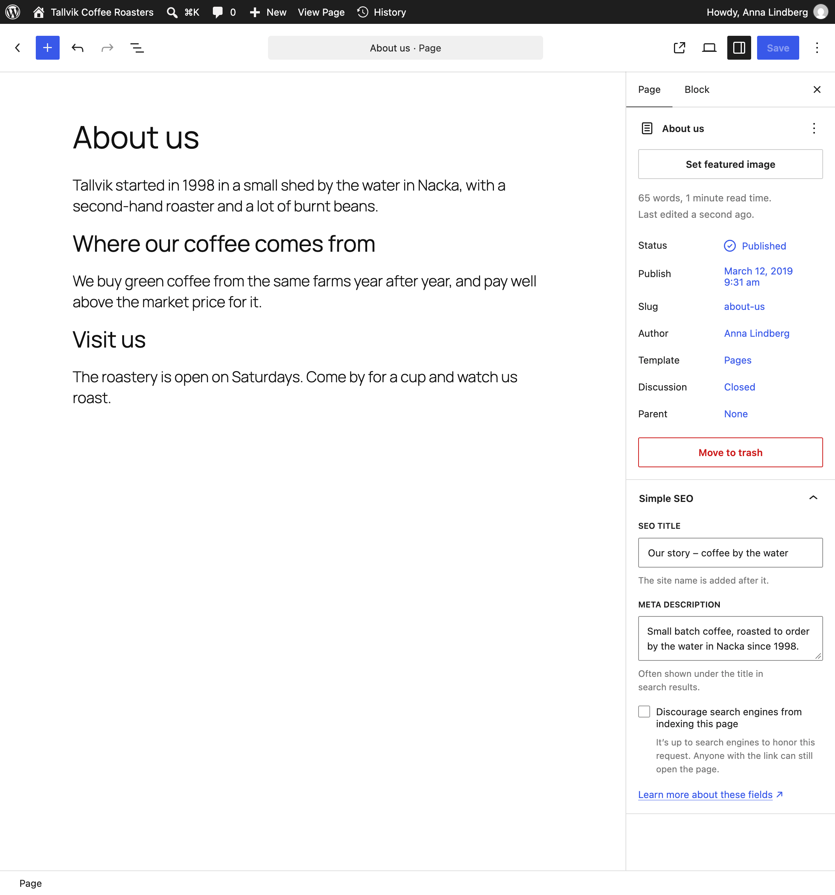
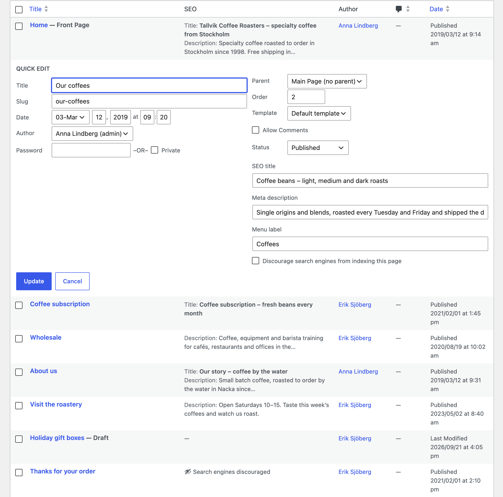
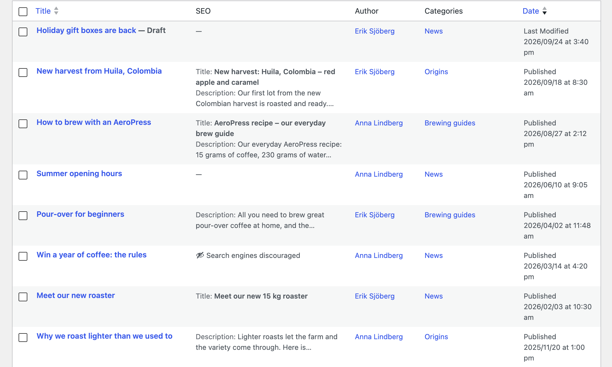
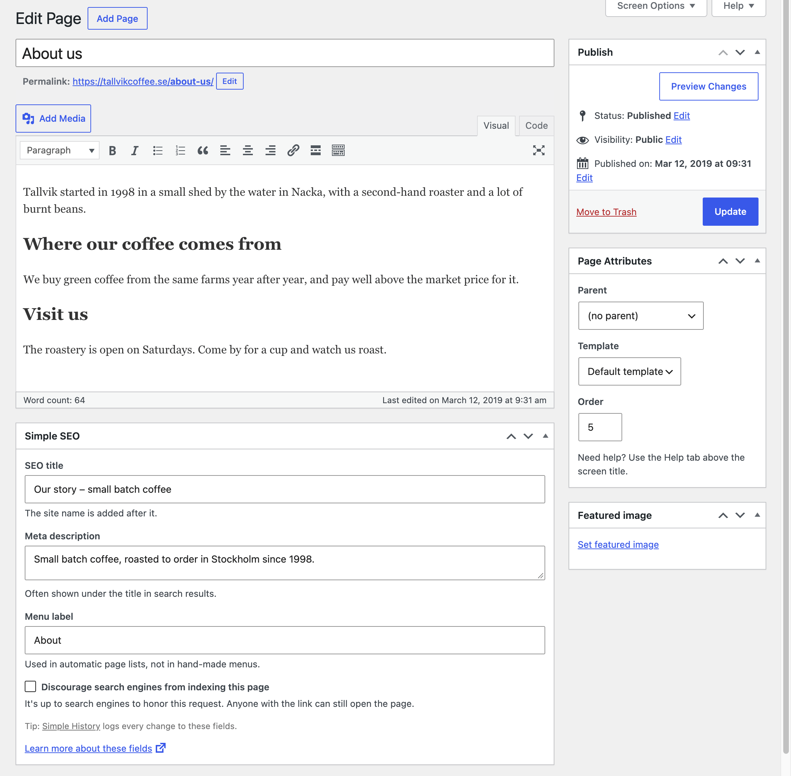
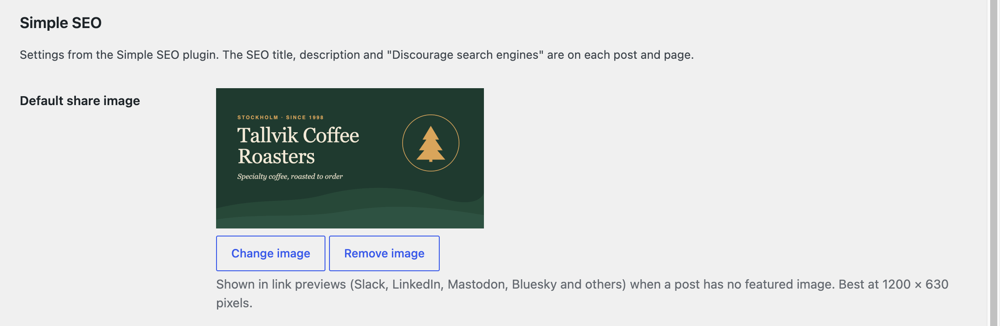
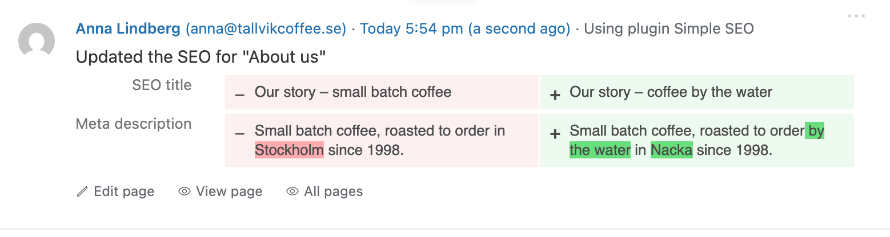

# Simple SEO

**The SEO basics for WordPress. Nothing more.**

[](https://wordpress.org/plugins/simple-seo/)
[](https://wordpress.org/plugins/simple-seo/advanced/)
[](https://github.com/bonny/WordPress-Simple-SEO/actions/workflows/tests.yml)
[](https://www.gnu.org/licenses/gpl-2.0.html)

A title, a description and a "don't index this" checkbox for every post and page. No AI scores, no traffic lights, no upsells, and no settings page to get lost in. Activate it, edit a page, done.

## What you get

Three fields on every post, page and public custom post type:

- **SEO title.** The title you give search engines and the browser tab. Your headline can say "About us" while search results say "Our story – small batch coffee".
- **Meta description.** The short text search engines often show under the title.
- **Discourage search engines.** For thank-you pages, test pages and anything else that doesn't belong in Google.

Fill in a field to use it. Leave it empty, and WordPress does what it always did.

And a few things that just happen:

- 🔗 **Link previews.** Open Graph tags, so links shared in Slack, iMessage, LinkedIn, Mastodon, Bluesky and Facebook get the right title, description and image. Pick a default image in Settings → General.
- 🗺️ **A cleaner sitemap.** WordPress's own `wp-sitemap.xml`, minus the pages you asked search engines to skip.
- ✍️ **Both editors.** A panel in the block editor sidebar, a box in the Classic Editor.
- ⚡ **Quick Edit.** An SEO column in the Posts and Pages lists, and the fields right in Quick Edit.
- 🤝 **Plays nice.** Yoast SEO, Rank Math, All in One SEO, SEOPress or The SEO Framework active? Simple SEO steps aside and says so, so you don't get duplicate tags.
- 📜 **Remembers everything** with [Simple History](https://wordpress.org/plugins/simple-history/): who changed a title, when, and what it said before.

<p align="center">
	
</p>

<details>
<summary><strong>More screenshots</strong></summary>

<br>

**The SEO column and Quick Edit in the Pages list**


**The same column for posts**


**The Classic Editor box**


**The one setting: a default share image**


**Every change logged in Simple History**


</details>

## What you don't get

On purpose, and forever-ish:

- ❌ A settings page. There's one setting, and it lives in Settings → General.
- ❌ Readability scores, keyword density or green lights.
- ❌ An `llms.txt` file, for now. As of 2026 Google doesn't use it and hardly any AI search engine fetches it. If that changes, so will we. Until then, AI search runs on the same basics as normal search: a page that can be crawled, with a good title and description.
- ❌ Dashboard widgets, admin notices or "Go Pro" banners.
- ❌ ~~Nags of any kind.~~ Okay, one small grey tip about [Simple History](https://wordpress.org/plugins/simple-history/). A developer has to eat.
- ❌ An "optimized by Simple SEO" comment in your page source. Your HTML is yours.
- ❌ Extra database queries on the front end. It reads the post WordPress has already loaded.

## Install

Search for **Simple SEO** in Plugins → Add New Plugin in your WordPress admin, or get it from [wordpress.org/plugins/simple-seo](https://wordpress.org/plugins/simple-seo/).

Needs WordPress 6.6 and PHP 7.4 or newer.

## For developers

The fields are plain, registered post meta, so WP-CLI, the REST API and AI tools can read and write them:

| Meta key | What |
|---|---|
| `_simple_seo_title` | SEO title |
| `_simple_seo_description` | Meta description |
| `_simple_seo_noindex` | Discourage search engines |

```bash
wp post meta update 123 _simple_seo_title "Our story – small batch coffee"
```

In the REST API they're under `meta`, with `?context=edit`, for users who can edit the post. Anonymous requests see nothing.

Everything Simple SEO outputs goes through a filter first:

```php
// Add the language to the link preview tags.
add_filter( 'simple_seo_link_preview_tags', function ( $tags ) {
	$tags['og:locale'] = 'sv_SE';
	return $tags;
} );
```

All filters, with examples: [`docs/hooks.md`](docs/hooks.md).

## Development

```bash
npm install && npm run build          # the block editor panel (Node 22.22+ or 24.15+)
composer install && composer check    # PHPCS and PHPStan
npm run env:start && npm run test:php # PHPUnit in wp-env
```

The code is in `src/`: namespaced PHP 7.4, one file per concern, functions rather than classes. `simple-seo.php` stays readable by PHP 5.6, so a site that's too old gets a friendly notice instead of a white screen. More in [`CLAUDE.md`](CLAUDE.md).

Issues and pull requests are welcome. Just know that the answer to a new feature is often "that's a bit much for a plugin called *Simple*".

## A bit of history

Simple SEO arrived on WordPress.org in August 2010, seven weeks before Yoast SEO. Then it slept from 2012 to 2026: fourteen years, 37 major WordPress releases and one block editor. Now it's awake again, dusted off, and still small on purpose. The whole story of the old SEO plugins: [`docs/seo-plugin-history.md`](docs/seo-plugin-history.md).

## More plugins by me

- [Simple History](https://wordpress.org/plugins/simple-history/): a log of everything that happens on your WordPress site.
- [CMS Tree Page View](https://wordpress.org/plugins/cms-tree-page-view/): your pages as a tree you can drag and drop.

Made by [Pär Thernström](https://eskapism.se/): one developer, no big company or investors behind it. If Simple SEO saves you time, [a donation](https://eskapism.se/sida/donate/) keeps it going. GPLv2 licensed.
